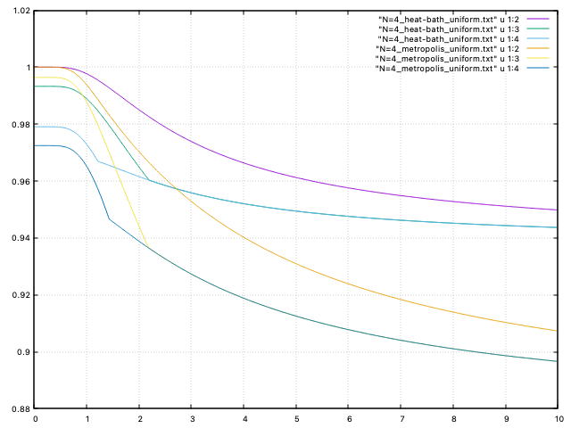
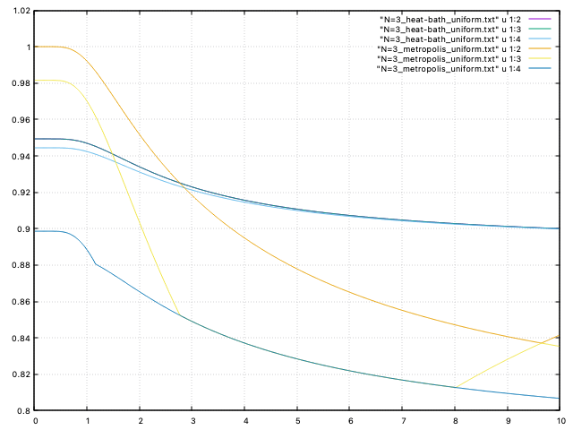

# ising-transition-matrix-eigenvalue

## 固有値の温度依存

`1:2` が第二固有値、 `1:3` が第三固有値・・・。

### N=4

### N=3

## N=2 での遷移行列

$N=2,T=\beta=1$ の遷移行列。
縦に合計すると確かに $1$ になる。

Metropolis

|  \ |          0 |          1 |          2 |   3 |          4 |   5 |   6 |          7 |          8 |   9 |  10 |         11 |  12 |         13 |         14 |         15 |
|---:|-----------:|-----------:|-----------:|----:|-----------:|----:|----:|-----------:|-----------:|----:|----:|-----------:|----:|-----------:|-----------:|-----------:|
|  0 |   0.981684 |        1/4 |        1/4 |   0 |        1/4 |   0 |   0 |          0 |        1/4 |   0 |   0 |          0 |   0 |          0 |          0 |          0 |
|  1 | 0.00457891 |   0.245421 |          0 | 1/4 |          0 | 1/4 |   0 |          0 |          0 | 1/4 |   0 |          0 |   0 |          0 |          0 |          0 |
|  2 | 0.00457891 |          0 |   0.245421 | 1/4 |          0 |   0 | 1/4 |          0 |          0 |   0 | 1/4 |          0 |   0 |          0 |          0 |          0 |
|  3 |          0 |        1/4 |        1/4 |   0 |          0 |   0 |   0 |        1/4 |          0 |   0 |   0 |        1/4 |   0 |          0 |          0 |          0 |
|  4 | 0.00457891 |          0 |          0 |   0 |   0.245421 | 1/4 | 1/4 |          0 |          0 |   0 |   0 |          0 | 1/4 |          0 |          0 |          0 |
|  5 |          0 |        1/4 |          0 |   0 |        1/4 |   0 |   0 |        1/4 |          0 |   0 |   0 |          0 |   0 |        1/4 |          0 |          0 |
|  6 |          0 |          0 | 0.00457891 |   0 | 0.00457891 |   0 |   0 | 0.00457891 |          0 |   0 |   0 |          0 |   0 |          0 | 0.00457891 |          0 |
|  7 |          0 |          0 |          0 | 1/4 |          0 | 1/4 | 1/4 |   0.245421 |          0 |   0 |   0 |          0 |   0 |          0 |          0 | 0.00457891 |
|  8 | 0.00457891 |          0 |          0 |   0 |          0 |   0 |   0 |          0 |   0.245421 | 1/4 | 1/4 |          0 | 1/4 |          0 |          0 |          0 |
|  9 |          0 | 0.00457891 |          0 |   0 |          0 |   0 |   0 |          0 | 0.00457891 |   0 |   0 | 0.00457891 |   0 | 0.00457891 |          0 |          0 |
| 10 |          0 |          0 |        1/4 |   0 |          0 |   0 |   0 |          0 |        1/4 |   0 |   0 |        1/4 |   0 |          0 |        1/4 |          0 |
| 11 |          0 |          0 |          0 | 1/4 |          0 |   0 |   0 |          0 |          0 | 1/4 | 1/4 |   0.245421 |   0 |          0 |          0 | 0.00457891 |
| 12 |          0 |          0 |          0 |   0 |        1/4 |   0 |   0 |          0 |        1/4 |   0 |   0 |          0 |   0 |        1/4 |        1/4 |          0 |
| 13 |          0 |          0 |          0 |   0 |          0 | 1/4 |   0 |          0 |          0 | 1/4 |   0 |          0 | 1/4 |   0.245421 |          0 | 0.00457891 |
| 14 |          0 |          0 |          0 |   0 |          0 |   0 | 1/4 |          0 |          0 |   0 | 1/4 |          0 | 1/4 |          0 |   0.245421 | 0.00457891 |
| 15 |          0 |          0 |          0 |   0 |          0 |   0 |   0 |        1/4 |          0 |   0 |   0 |        1/4 |   0 |        1/4 |        1/4 |   0.981684 |

Heat bath

|  \ |         0 |          1 |          2 |   3 |          4 |   5 |          6 |          7 |          8 |          9 |  10 |         11 |  12 |         13 |         14 |        15 |
|---:|----------:|-----------:|-----------:|----:|-----------:|----:|-----------:|-----------:|-----------:|-----------:|----:|-----------:|----:|-----------:|-----------:|----------:|
|  0 | 0.0179862 | 0.00449655 | 0.00449655 |   0 | 0.00449655 |   0 |          0 |          0 | 0.00449655 |          0 |   0 |          0 |   0 |          0 |          0 |         0 |
|  1 |  0.245503 |        1/2 |          0 | 1/8 |          0 | 1/8 |          0 |          0 |          0 | 0.00449655 |   0 |          0 |   0 |          0 |          0 |         0 |
|  2 |  0.245503 |          0 |        1/2 | 1/8 |          0 |   0 | 0.00449655 |          0 |          0 |          0 | 1/8 |          0 |   0 |          0 |          0 |         0 |
|  3 |         0 |        1/8 |        1/8 | 1/2 |          0 |   0 |          0 |        1/8 |          0 |          0 |   0 |        1/8 |   0 |          0 |          0 |         0 |
|  4 |  0.245503 |          0 |          0 |   0 |        1/2 | 1/8 | 0.00449655 |          0 |          0 |          0 |   0 |          0 | 1/8 |          0 |          0 |         0 |
|  5 |         0 |        1/8 |          0 |   0 |        1/8 | 1/2 |          0 |        1/8 |          0 |          0 |   0 |          0 |   0 |        1/8 |          0 |         0 |
|  6 |         0 |          0 |   0.245503 |   0 |   0.245503 |   0 |   0.982014 |   0.245503 |          0 |          0 |   0 |          0 |   0 |          0 |   0.245503 |         0 |
|  7 |         0 |          0 |          0 | 1/8 |          0 | 1/8 | 0.00449655 |        1/2 |          0 |          0 |   0 |          0 |   0 |          0 |          0 |  0.245503 |
|  8 |  0.245503 |          0 |          0 |   0 |          0 |   0 |          0 |          0 |        1/2 | 0.00449655 | 1/8 |          0 | 1/8 |          0 |          0 |         0 |
|  9 |         0 |   0.245503 |          0 |   0 |          0 |   0 |          0 |          0 |   0.245503 |   0.982014 |   0 |   0.245503 |   0 |   0.245503 |          0 |         0 |
| 10 |         0 |          0 |        1/8 |   0 |          0 |   0 |          0 |          0 |        1/8 |          0 | 1/2 |        1/8 |   0 |          0 |        1/8 |         0 |
| 11 |         0 |          0 |          0 | 1/8 |          0 |   0 |          0 |          0 |          0 | 0.00449655 | 1/8 |        1/2 |   0 |          0 |          0 |  0.245503 |
| 12 |         0 |          0 |          0 |   0 |        1/8 |   0 |          0 |          0 |        1/8 |          0 |   0 |          0 | 1/2 |        1/8 |        1/8 |         0 |
| 13 |         0 |          0 |          0 |   0 |          0 | 1/8 |          0 |          0 |          0 | 0.00449655 |   0 |          0 | 1/8 |        1/2 |          0 |  0.245503 |
| 14 |         0 |          0 |          0 |   0 |          0 |   0 | 0.00449655 |          0 |          0 |          0 | 1/8 |          0 | 1/8 |          0 |        1/2 |  0.245503 |
| 15 |         0 |          0 |          0 |   0 |          0 |   0 |          0 | 0.00449655 |          0 |          0 |   0 | 0.00449655 |   0 | 0.00449655 | 0.00449655 | 0.0179862 |
